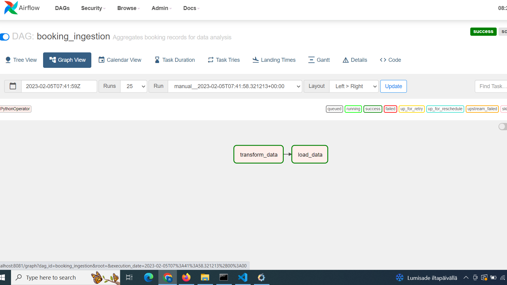

# Data ingestion pipeline using Apache Airflow

- Prepare the database first by runing the yaml file: docker-compose up airflow-init

This is going to created db/airflow.db sqlite database

- Launch Airflow docker-compose up

Wait for scheduler and webserver to get healthy, then go to localhost:8081
- put your username: admin and password: airflow

Enable the DAG and watch it ingest data.

